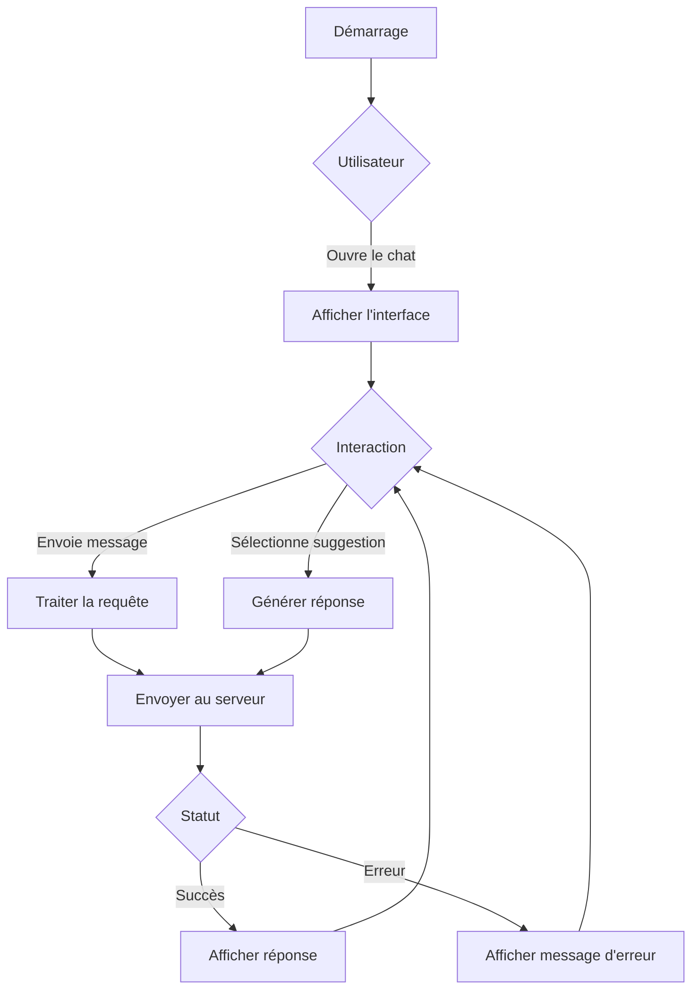

# Analyse du Chat Widget

## État Actuel

### Points Forts ✅

1. **Interface Utilisateur**
   - Design moderne avec thème clair/sombre
   - Boutons de navigation clairs
   - Indicateurs visuels pour les messages entrants/sortants

2. **Fonctionnalités**
   - Réponses contextuelles
   - Suggestions de réponses rapides
   - Gestion des erreurs avec messages clairs
   - Indicateur de frappe (typing indicator)

3. **Performance**
   - Chargement des messages fluide
   - Défilement automatique vers le bas
   - Gestion efficace de l'état des messages

### Points à Améliorer ⚠️

1. **Expérience Mobile**
   - Taille de police parfois petite sur très petits écrans
   - Zone de saisie pourrait être plus grande sur mobile
   - Les boutons de suggestion pourraient être plus faciles à toucher

2. **Fonctionnalités Manquantes**
   - Pas d'indication de lecture des messages
   - Pas de support pour les pièces jointes
   - Pas d'historique de conversation

3. **Accessibilité**
   - Contraste des couleurs à vérifier
   - Navigation au clavier limitée
   - Étiquettes ARIA manquantes

## Diagramme de Flux

## Recommandations d'Amélioration

### 1. Améliorations d'Interface
- [ ] Agrandir la zone de saisie sur mobile
- [ ] Ajouter des animations de transition
- [ ] Améliorer le contraste des couleurs

### 2. Nouvelles Fonctionnalités
- [ ] Ajouter le support des pièces jointes
- [ ] Implémenter un historique des conversations
- [ ] Ajouter des réactions aux messages

### 3. Performance
- [ ] Implémenter la pagination pour les longs historiques
- [ ] Optimiser le rendu des messages
- [ ] Mettre en cache les réponses fréquentes

### 4. Accessibilité
- [ ] Ajouter des attributs ARIA
- [ ] Améliorer la navigation au clavier
- [ ] Tester avec des lecteurs d'écran

## Prochaines Étapes

1. Prioriser les améliorations d'interface mobile
2. Implémenter le support des pièces jointes
3. Améliorer l'accessibilité
4. Ajouter des tests automatisés

---
*Dernière mise à jour : 17/10/2025*
