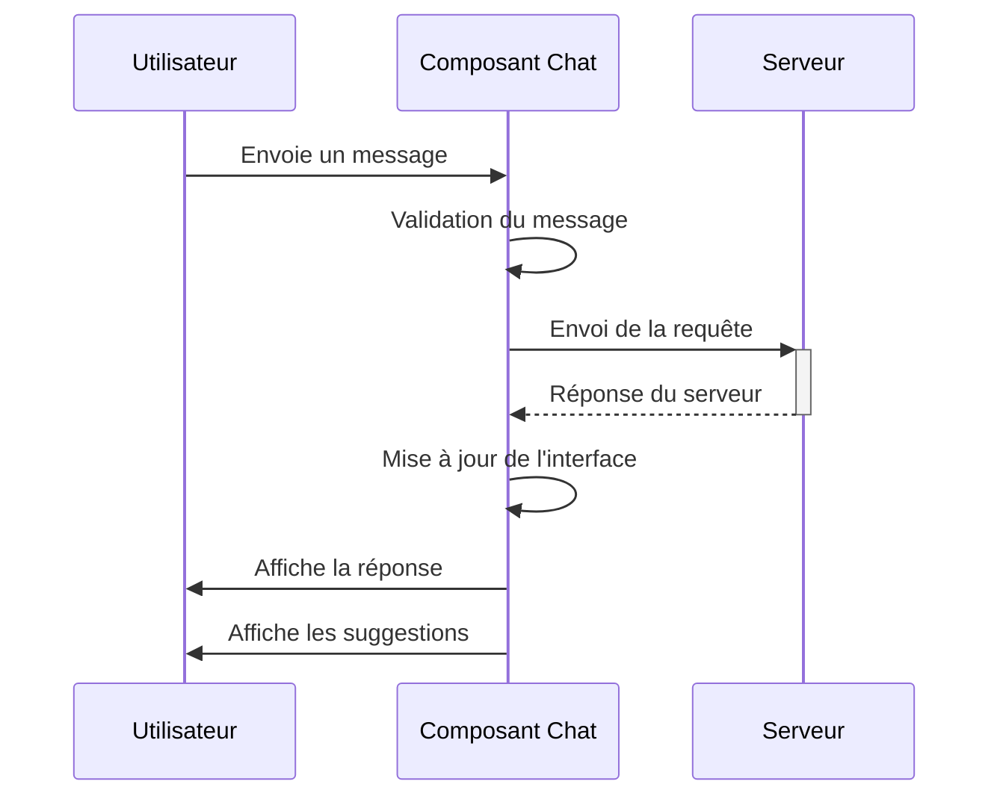
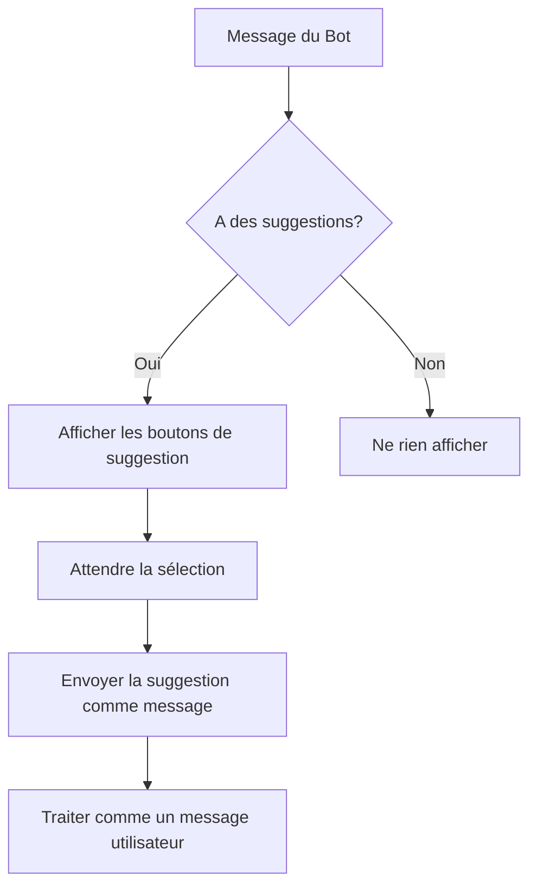
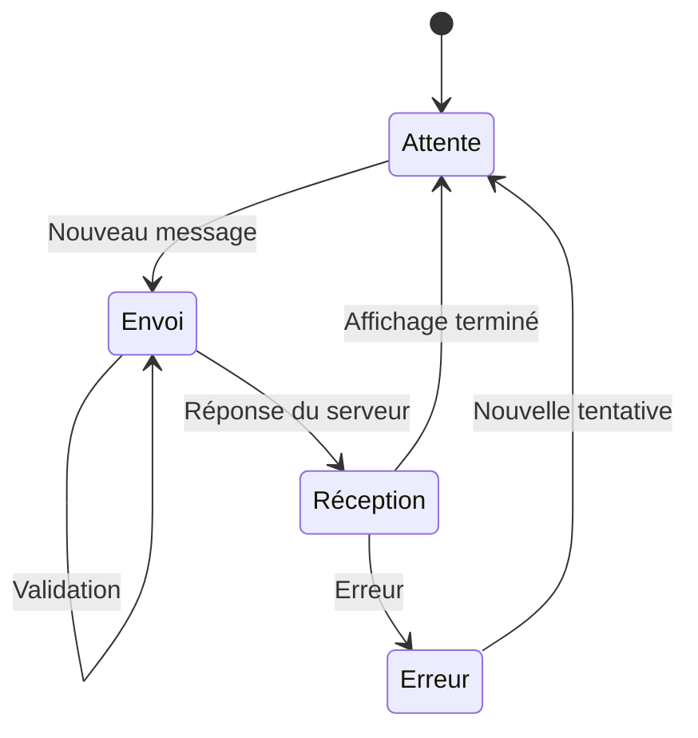
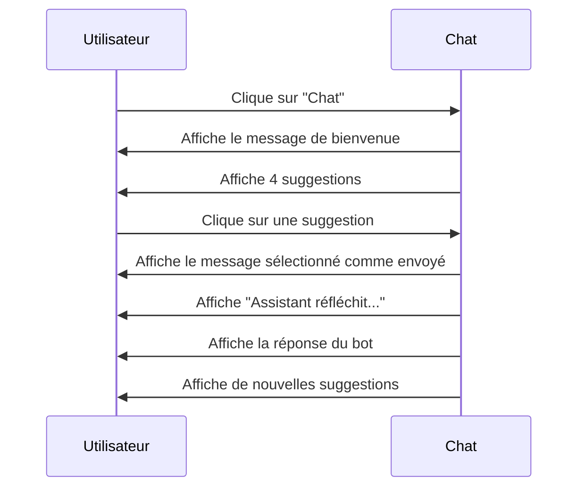

# Analyse du Flux de Messages et Suggestions

## 1. Flux Principal des Messages

## 2. Types de Messages

### Messages Utilisateur
- Format: Texte simple
- Taille maximale: 500 caractères
- Validation: Non vide, pas que des espaces

### Messages Bot
- Format: Texte avec support Markdown
- Peut inclure des sauts de ligne
- Peut inclure des liens cliquables

## 3. Gestion des Suggestions

### Comportement des Suggestions
- Affichage: Sous le dernier message du bot
- Format: Boutons cliquables
- Comportement au clic:
  - Envoie le texte du bouton comme message
  - Désactive les boutons pendant le chargement
  - Affiche l'indicateur de frappe

## 4. États du Chat

## 5. Améliorations Proposées

### Pour les Messages
- [ ] Ajouter la prévisualisation des liens
- [ ] Support des emojis natifs
- [ ] Indicateur de lecture
- [ ] Édition des messages envoyés

### Pour les Suggestions
- [ ] Grouper les suggestions par catégorie
- [ ] Ajouter des icônes aux suggestions
- [ ] Permettre le défilement horizontal si nombreuses
- [ ] Ajouter des suggestions contextuelles

## 6. Exemple de Flux Complet

## 7. Bonnes Pratiques Implémentées

- Limitation de la taille des messages
- Feedback visuel pendant le chargement
- Gestion des erreurs utilisateur
- Mise en cache des réponses
- Validation côté client

## 8. Prochaines Étapes

1. Implémenter la pagination pour l'historique
2. Ajouter la persistance des messages
3. Améliorer la gestion des erreurs réseau
4. Ajouter des animations de transition

---
*Dernière mise à jour : 17/10/2025*
